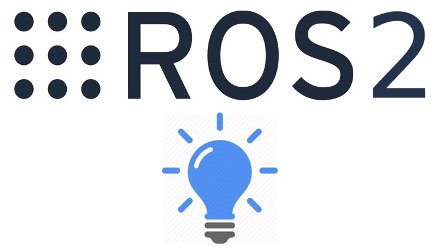

---
**Migration of JDEROBOT tools to ROS2**

ROS has changed the world of Robotics, now we need not write every single library for a new
project which has already been implemented before. Researchers and developers can work on
top of developed tools and libraries. ROS2 has brought good changes with it, including all
features of ROS along with new ones to address shortcomings in earlier version. To make use
of those characteristics it is important to migrate our tools and drivers. This project aims to adapt
drivers and some crucial JDERobot tools to make them ROS2 compatible. In this proposal
visualization ​and​ visualStates​ tools are targeted which will be beneficial for the community.

---