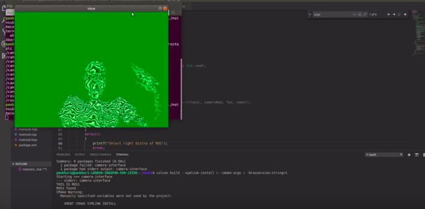
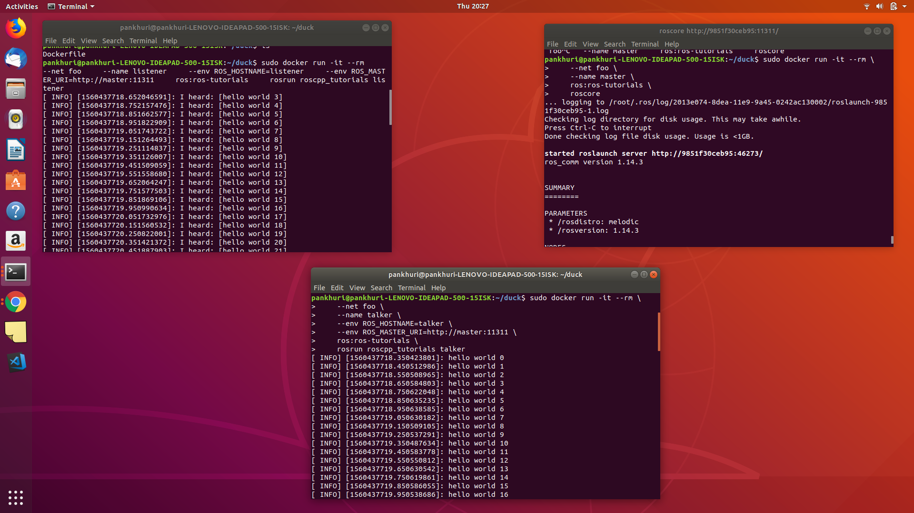

**From Hello World to Image display**


Last week I had worked on creating an interface for ROS1 and ROS2 and created a dummy library for publishing 'Hello World'. This  week I had to modify that interface to display image by uniting with image drivers.

Also it was discussed that we cannot switch the environment at runtime in c++ build currently so we should move to docker. Another task this week was to create different Dockerfiles.


**Wrapper for image display**

First I used my current interface for publishing the image. Initially I used the example given in ROS tutorials for displaying an image from a given path. This worked fine so next I moved to getting images from webcam. Gradually I moved individual subscriber nodes also to the interface.

When running this code from ROS1 I am getting this kind of image.



I looked into the issue of green background in ....{}  but could not solve it yet. I will look more into it.

ROS2 driver which was created before the GSoC period and improved in first week was used here. That was created in ROS2-Crystal but in this distro (Dashing), this code was giving errors due to changed conventions so firstly This code was corrected. This can be accessed in [ROS2-Image driver](https://github.com/TheRoboticsClub/colab-gsoc2019-Pankhuri_Vanjani/tree/master/ros2-drivers). 

With ROS2 the interface is working well. 

Complete video can be watched by clicking on the image.

 [](http://www.youtube.com/watch?v=0QGvgdslvIU "Image-display")

**Steps to run this interface:**

mainpub.cpp: Publisher in this interface

mainsub.cpp: Subscriber in this interface

* ROS

  * Delete all previously buid and cache folders 
  
  * First Build the project: ``` colcon build --symlink-install \--cmake-args \ -Drosversion:string=1```
   
   string = 1 for for ROS1
  
  Run:
  
  * For Publishing image ``` ./build/camera-interface/mainpub 1 2  ```
  
   argv[1] = 1 For ROS1
   argv[2] = 2 (For selecting video device. In my Laptop device number 2 givs fine video stream.)
   
  * For Listening to  image ``` ./build/camera-interface/mainsub 1 /camserver/rgb  ```
  
   argv[1] = 1 For ROS1
   argv[2] = /camserver/rgb (For selecting the right topic to subscribe to)  
   
* ROS2

  * Delete all previously buid and cache folders 
  
  * First Build the project: ``` colcon build --symlink-install \--cmake-args \ -Drosversion:string=0```
   
   string = 0 for ROS2
  
  * Run ``` ./build/camera-interface/mainpub 2  ```
  
   argv[1] = 2 For ROS2
      
  * For Listening to  image ``` ./build/camera-interface/mainsub 2 /camserver/rgb  ```
  
   argv[1] = 2 For ROS2
   argv[2] = /camserver/rgb (For selecting the right topic to subscribe to)  
   

**Further improvement in architecture**

Further improvement should be made in this code architecture to bring uniformity in both ROS and ROS1. Current architecture in using a jdrc pointer variable and prefix. After correcting these two errors:

* Green background in images

* reading configurations from yaml file 

```
mainpub.cpp:(.text+0x453): undefined reference to `YAML::LoadFile(std::__cxx11::basic_string<char, std::char_traits<char>, std::allocator<char> > const&)'
clang: error: linker command failed with exit code 1 (use -v to see invocation)
```

I might modify the code further.


**Progress in DOCKER FILES**

My task this week was to create dockerfiles for 3 different environments

* ROS1

* ROS2

* ROS1+ROS2

Since, I wasn't familiar with docker earlier I watched the suggested videos [Docker](https://youtu.be/YFl2mCHdv24) , [Docker-compose](https://youtu.be/Qw9zlE3t8Ko) and documentation to learn the basics.  

Now, I used the existing images to create different environments.

1. ROS Melodic

Dockerfile can be found in [ROS-Melodic dockerfile](https://github.com/TheRoboticsClub/colab-gsoc2019-Pankhuri_Vanjani/tree/master/Dockerfiles/ROS1%20docker)



2. ROS Dashing
Dockerfile can be found in [ROS-Melodic dockerfile](https://github.com/TheRoboticsClub/colab-gsoc2019-Pankhuri_Vanjani/tree/master/Dockerfiles/ROS2%20docker)

3. ROS Melodic + ROS Dashing

  * Approach 1 : *multi-stage Dockerfile*
  
  Meged the content of both docker files. Basically 'multiple FROM' statements to get the existing images from ROS
  
  Result: Fail. It turned into the environment of the Distro which was there in the last 'FROM..' installation statements in Dockerfile.
  
  * Approach 2
  
  *Multi Containers with Docker-compose*  

Link to Docker file: [docker-file](https://github.com/TheRoboticsClub/colab-gsoc2019-Pankhuri_Vanjani/tree/master/Dockerfiles/ROS1%2BROS2%20docker)

Status:

Build: ```sudo docker-compose build```

```
pankhuri@pankhuri-LENOVO-IDEAPAD-500-15ISK:~/Docker/compose-ros/compose$ sudo docker-compose build
Building ros-melodic
Step 1/12 : FROM ubuntu:bionic
 ---> 7698f282e524
Step 2/12 : RUN apt update
 ---> Using cache
 ---> 568646da8ec6
Step 3/12 : RUN apt-get install -y lsb-release
 ---> Using cache
 ---> e596418dd9b3
Step 4/12 : RUN apt-get update && apt-get install -y gnupg2
 ---> Using cache
 ---> c286b7ad7497
Step 5/12 : RUN sh -c 'echo "deb http://packages.ros.org/ros/ubuntu $(lsb_release -sc) main" > /etc/apt/sources.list.d/ros-latest.list'
 ---> Using cache
 ---> 78d04a1323e3
Step 6/12 : RUN apt-key adv --keyserver 'hkp://keyserver.ubuntu.com:80' --recv-key C1CF6E31E6BADE8868B172B4F42ED6FBAB17C654
 ---> Using cache
 ---> f299aab835d2
Step 7/12 : RUN apt update
 ---> Using cache
 ---> 17d94468b7a1
Step 8/12 : RUN apt-get install -y tzdata
 ---> Using cache
 ---> 0edf53f0acb2
Step 9/12 : RUN apt install -y ros-melodic-desktop-full
 ---> Using cache
 ---> 7cd5b422f162
Step 10/12 : RUN apt install -y python-rosinstall python-rosinstall-generator python-wstool build-essential
 ---> Using cache
 ---> 317774ee917a
Step 11/12 : RUN rosdep init
 ---> Using cache
 ---> 0817ce31cb84
Step 12/12 : RUN rosdep update
 ---> Using cache
 ---> 1cab27d973e2

Successfully built 1cab27d973e2
Successfully tagged compose_ros-melodic:latest
Building ros-dashing
Step 1/12 : FROM ubuntu:bionic
 ---> 7698f282e524
Step 2/12 : RUN apt update
 ---> Using cache
 ---> 568646da8ec6
Step 3/12 : RUN apt update
 ---> Using cache
 ---> 00045212a5ec
Step 4/12 : RUN apt-get -y install lsb-release
 ---> Using cache
 ---> ebe7739f5832
Step 5/12 : RUN apt install -y curl gnupg2 lsb-release
 ---> Using cache
 ---> 08e7835374cb
Step 6/12 : RUN curl http://repo.ros2.org/repos.key | apt-key add -
 ---> Using cache
 ---> 39571bff8738
Step 7/12 : RUN sh -c 'echo "deb [arch=amd64,arm64] http://packages.ros.org/ros2/ubuntu `lsb_release -cs` main" > /etc/apt/sources.list.d/ros2-latest.list'
 ---> Using cache
 ---> 008a3501d19f
Step 8/12 : RUN apt update
 ---> Using cache
 ---> e2507e06a78f
Step 9/12 : RUN apt-get install -y tzdata
 ---> Using cache
 ---> 2e5d879aa103
Step 10/12 : RUN apt install -y ros-dashing-desktop
 ---> Using cache
 ---> 15899903dddf
Step 11/12 : RUN apt install -y python3-argcomplete
 ---> Using cache
 ---> b660771fbba1
Step 12/12 : RUN apt update
 ---> Using cache
 ---> 0b9120516da4

Successfully built 0b9120516da4
Successfully tagged compose_ros-dashing:latest

```
Start ```sudo docker-compose up ```

```
pankhuri@pankhuri-LENOVO-IDEAPAD-500-15ISK:~/Docker/compose-ros/compose$ sudo docker-compose up
Starting compose_ros-melodic_1 ... done
Starting compose_ros-dashing_1 ... done
Attaching to compose_ros-melodic_1, compose_ros-dashing_1
compose_ros-dashing_1 exited with code 0
compose_ros-melodic_1 exited with code 0

```
So, we can see it exits right from here.


```
pankhuri@pankhuri-LENOVO-IDEAPAD-500-15ISK:~/Docker/compose-ros/compose$ sudo docker-compose ps
        Name             Command    State    Ports
--------------------------------------------------
compose_ros-dashing_1   /bin/bash   Exit 0        
compose_ros-melodic_1   /bin/bash   Exit 0  
```
For executing: ``` sudo docker exec -it compose_ros-melodic_1 /bin/bash ````

```
pankhuri@pankhuri-LENOVO-IDEAPAD-500-15ISK:~/Docker/compose-ros/compose$ sudo docker exec -it compose_ros-melodic_1 /bin/bash
Error response from daemon: Container 3bda7fdfa704745fe9cdf738c06adae18410d83f7cf40a44330fb7a67fe6608f is not running
```

Using  ```sudo docker-compose images```

```
      Container             Repository         Tag       Image Id      Size  
-----------------------------------------------------------------------------
compose_ros-dashing_1   compose_ros-dashing   latest   0b9120516da4   2.29 GB
compose_ros-melodic_1   compose_ros-melodic   latest   1cab27d973e2   2.76 GB


```

Running one container ``` sudo docker run -t 0b9120516da4  ```

```
root@26926e9d45ff:/#

```

Links which were referred: [Docker Compose](https://www.linux.org/threads/docker-compose.23562/?fbclid=IwAR2k5OB6GzXVAHoxhuTZrde8Bqh5W8kDDMs7DMoZ-uknVxd66NKDvXO8RcY)

  * Approach 3   *Multi-Conatiners with Entrypoints*
   
   (post images and result)
   
  * Approach 4   *Download both ROS distros and keep separate Entrypoints*
   
   (Post images and result)
   
   I could not reach to final solution here.
   
   I think I am close to the right thing but discussing this issue with the mentors in this week's meeting would help in moving ahead with finishing it.
  
