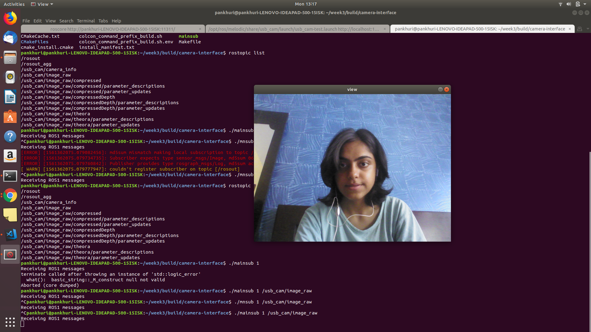

---
layout: post
title: Week-4
Subtitle: A week full of learning new things and researching
date: 2019-06-22
---	

**A week full of learning new things and researching**

*Discussion: Outcomes of next week*

 * Check the ROS1 part of image viewer with usb can instead of current drivers to get away with green images.
 
 * Work on issues to complete the 3rd docker image of ROS1 + ROS2.
 
 * Refine the turtlebot2 support with ROS1 and ROS2. Check it's compatibility.
 
 * Move ahead with the 3rd task and create a mini car is kinda tool to teleoperate turtlebot2

**Corrected green background issue in image tool of ROS1** 

In the image tool developed last week I was getting errors of green background. Possible reason behind this was selection of wrong video driver. As suggested by the mentors instead of using mainpub publisher I used usb-cam driver for publishing images and the tool now worked well.



Updated Instructions for running with ROS1:

* In Terminal 1:

```
source /opt/ros/melodic/setup.bash

roscore

```
* In Terminal 2:```

```
source /opt/ros/melodic/setup.bash

rosrun rosrun usb_cam usb_cam_node /dev/video0

```

N.B. Check video device number in case it doesn't work.

If you got error like 
``` 
[mjpeg @ 0x56008efbd880] No JPEG data found in image
[ERROR] [1561362230.096677531]: Error while decoding frame.

```
Run it via roslaunch ``roslaunch usb_cam usb_cam-test.launch `` It will find and bring the correct video driver, so then publish via rosrun for testing.

**Learn Docker properly**

Last week task involved creating docker files  for 3 different environment. But I had done several mistakes for 'ROS1+ROS2 environment'and I was suggested to spend 2-3 days in learning concepts of docker very clearly as I might be needing it in later phases too.

So, I Did a Udemy course on Docker-mastery.

**Runtime independency for C++ Interface**

Discussion for achieving runtime independency for C++ with mentors. Keypoints of the discussion was:

" we install all the **Built JdeRobot tools** inside this docker image and user can then just run any publisher or subscriber inside this docker image. "


(Image and work done to be posted here)

*Do we require docker here..? If not .. why not?*

(Conclusion here)

**Mini Carviz tool to teleoperate turtlebot2**

*Turtlebot2 and Kobuki drivers*

turtlebot2 drivers are not yet developed in ROS2 Dashing. Link to discussion on ROS forum [drivers](http://answers.ros.org/question/326512/turtlebot-support-in-ros2-dashing/)

I further researched intro existing driver support for ROS2 Dashing.

   **None of the mobile robots are currently supported in Dashing** 

With further research into it I found MARA robot has drivers supported in both Melodic and Dashing.I am attaching the relevant links here:

* [MARA](https://github.com/AcutronicRobotics/MARA)

* [move_it2](https://github.com/AcutronicRobotics/moveit2/tree/prepare-dashing-ci/moveit_kinematics) [move-it2](https://www.linkedin.com/pulse/moveit-2-journey-first-demonstrator-ros-planning-goal-v%C3%ADctor/)

* [Moveit2](https://acutronicrobotics.com/news/moveit-2-journey-moveit-2-alpha-release/)

* [Recent_turtlebot2-blog](https://qiita.com/l1sum/items/78f1a904fff3d389d8be)


