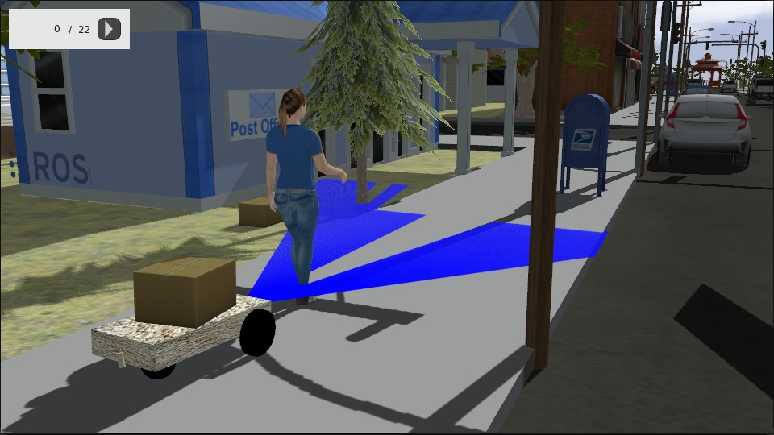
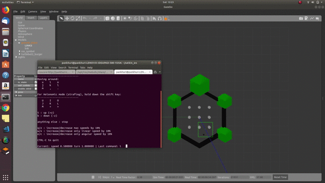
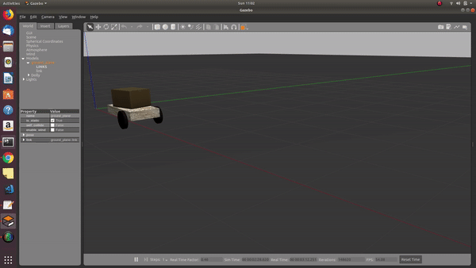

---
layout: post
title: Week-5
date: 2019-06-28
---	

**Let's begin the teleoperation**

*Search for mobile robot for RO2 dashing ends here!*

We got Dolly, a differential drive mobile robot.

**Teleoperation tool a ROS1 and ROS2 interface for controlling dolly robot and turtlebot.**

 

**Tasks for this week**

* **Test the dolly robot movement with command line publisher**
**(Done)**

   

* **Test the twist_keyboard in c++ for ROS1**
**(Done)**
    
  Make sure you hvae turtlebot drivers installed  by sudo apt-get install ```ros-melodic-turtlebot3*```

    ```source /opt/ros/melodic/setup.bash```

    ``` cd catkin_ws```

    ```catkin_make```

    ```cd src```

    ```git clone 'repo.git' ```

    ```cd..```

    ```catkin_make```

    ``` source devel/setup.bash```

    ```rosrun teleop_twist_keyboard_cpp teleop_twist_keyboard```

* **Connect the twist_keyboard to turtlebot and control it**
**(Done)**

   Steps:

    Terminal 1:

    ```source /opt/ros/melodic/setup.bash```

    ```roscore```

    Terminal 2:

    ```source /opt/ros/melodic/setup.bash```

    ```export TURTLEBOT3_MODEL=burger ```

    ```roslaunch turtlebot3_gazebo turtlebot3_world.launch```

    Terminal 3:

    Follow instructions for *Test the twist_keyboard in c++ for ROS1*

    

(Video is not much clear, I will make a better video )
* **Code out the twist_keyboard in c++ for ROS2**

* **Connect the ROS2 teleoperator keyboard to dolly robot**

(Done with Python driver)

   Steps
   
   Terminal 1:
    
    cd ros2_ws
    
    cd src 
    
    git clone 'repo.git'
    
    cd ..
    
    colcon build --symlink-install
    
    cd ..
    
    . ./ros2_ws/install/setup.bash
    
    teleop_twist_keyboard /cmd_vel:=/dolly/cmd_vel
  
  Terminal 2:
  
  ```
        cd ~/ws
        
        colcon build
        
        . /usr/share/gazebo/setup.sh
        
        . ~/ws/install/setup.bash
        
        export GAZEBO_RESOURCE_PATH=/home/`whoami`/ws/src/dolly/dolly_gazebo/worlds:${GAZEBO_RESOURCE_PATH}
        
        export GAZEBO_MODEL_PATH=/home/`whoami`/ws/src/dolly/dolly_gazebo/models:${GAZEBO_MODEL_PATH}
    
        ros2 launch dolly_gazebo dolly.launch.py world:=dolly_empty.world
   ```
     

    


* **Create Interface for ROS1 + ROS2 teleoperator**
