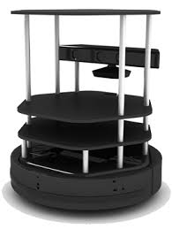

---
layout: post
title: Week-5
date: 2019-06-28
---	

**Let's begin the teleoperation**

*Search for mobile robot for RO2 dashing ends here!*

We got Dolly, a differential drive mobile robot.

**Teleoperation tool a ROS1 and ROS2 interface for controlling dolly robot and turtlebot.**

