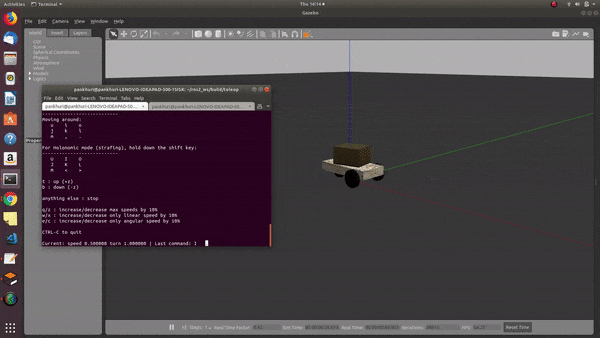

---
layout: post
title: Week-6
date: 2019-07-03
---	

**Goals of the week**

* Teleoperation in ROS2 with C++

* Python sensor compatibility in ROS1 and ROS2 (Camera drivers)

* Bring Image viewer tool into our Jderobot CamViz 

**Teleoperation tool finished**

Links: 

**c++**

ROS1 : [Teleop_twist_keyboard_cpp](https://github.com/TheRoboticsClub/colab-gsoc2019-Pankhuri_Vanjani/tree/master/Teleoperation_tool/teleop_twist_keyboard_cpp)

ros2 : [ros2_teleop_keyboard_c++](https://github.com/TheRoboticsClub/colab-gsoc2019-Pankhuri_Vanjani/tree/master/Teleoperation_tool/ros2_teleop_keyboard_c%2B%2B)

**Python**

ROS1 : [ros1-teleop.py](https://github.com/TheRoboticsClub/colab-gsoc2019-Pankhuri_Vanjani/blob/master/Teleoperation_tool/ros1-teleop.py)

ROS2 : [ros2-teleop.py](https://github.com/TheRoboticsClub/colab-gsoc2019-Pankhuri_Vanjani/blob/master/Teleoperation_tool/ros2-teleop.py)

Interface scripts:

1. [test.py](https://github.com/TheRoboticsClub/colab-gsoc2019-Pankhuri_Vanjani/blob/master/Teleoperation_tool/test.py)

2. [pyinterface-environment_set](https://github.com/TheRoboticsClub/colab-gsoc2019-Pankhuri_Vanjani/blob/master/Teleoperation_tool/pyinterface.py)

**Teleoperation in ROS2 with C++**

 

