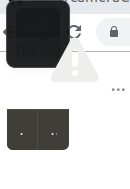

---
layout: post
title: Week-8
date: 2019-07-15
---	

**Goals of the week**

* Rosification of camViz tool

* Adding support of ROS2 in newer camViz tool

**Progress**

Basically I have to use previously build Subscriber camera-interface with a  C++ based GUI!!!

1. GTK 2.0 and GTK 3.0 mix up issue : old Status - Solved

This problem came again.

```
pankhuri@pankhuri-LENOVO-IDEAPAD-500-15ISK:~/week8-camviz/build$ cmake ..
THIS IS ROS1
ROS1 found
-- Configuring done
-- Generating done
-- Build files have been written to: /home/pankhuri/week8-camviz/build
pankhuri@pankhuri-LENOVO-IDEAPAD-500-15ISK:~/week8-camviz/build$ make -j 4
Scanning dependencies of target camViz
[ 33%] Building CXX object CMakeFiles/camViz.dir/camViz.cpp.o
[ 66%] Building CXX object CMakeFiles/camViz.dir/viewer.cpp.o
In file included from /opt/jderobot/include/jderobot/visionlib/colorspaces/colorspacesmm.h:25:0,
                 from /home/pankhuri/week8-camviz/viewer.h:29,
                 from /home/pankhuri/week8-camviz/viewer.cpp:22:
/opt/jderobot/include/jderobot/visionlib/colorspaces/imagecv.h:123:38: warning: dynamic exception specifications are deprecated in C++11 [-Wdeprecated]
     Image& convert(Image& dst) const throw(NoConversion);
                                      ^~~~~
/opt/jderobot/include/jderobot/visionlib/colorspaces/imagecv.h:162:36: warning: dynamic exception specifications are deprecated in C++11 [-Wdeprecated]
     void toGRAY8(Image& dst) const throw(FormatMismatch);
                                    ^~~~~
/opt/jderobot/include/jderobot/visionlib/colorspaces/imagecv.h:163:35: warning: dynamic exception specifications are deprecated in C++11 [-Wdeprecated]
     void toYUY2(Image& dst) const throw(FormatMismatch);
                                   ^~~~~
/opt/jderobot/include/jderobot/visionlib/colorspaces/imagecv.h:164:35: warning: dynamic exception specifications are deprecated in C++11 [-Wdeprecated]
     void toHSV8(Image& dst) const throw(FormatMismatch);
                                   ^~~~~
/opt/jderobot/include/jderobot/visionlib/colorspaces/imagecv.h:165:36: warning: dynamic exception specifications are deprecated in C++11 [-Wdeprecated]
     void toYCRCB(Image& dst) const throw(FormatMismatch);
                                    ^~~~~
/opt/jderobot/include/jderobot/visionlib/colorspaces/imagecv.h:184:58: warning: dynamic exception specifications are deprecated in C++11 [-Wdeprecated]
     static Image& imageCvt(const Image& src, Image& dst) throw(NoConversion);
                                                          ^~~~~
/opt/jderobot/include/jderobot/visionlib/colorspaces/imagecv.h:216:36: warning: dynamic exception specifications are deprecated in C++11 [-Wdeprecated]
     void toGRAY8(Image& dst) const throw(FormatMismatch);
                                    ^~~~~
/opt/jderobot/include/jderobot/visionlib/colorspaces/imagecv.h:217:35: warning: dynamic exception specifications are deprecated in C++11 [-Wdeprecated]
     void toRGB8(Image& dst) const throw(FormatMismatch);
                                   ^~~~~
/opt/jderobot/include/jderobot/visionlib/colorspaces/imagecv.h:218:36: warning: dynamic exception specifications are deprecated in C++11 [-Wdeprecated]
     void toYCRCB(Image& dst) const throw(FormatMismatch);
                                    ^~~~~
/opt/jderobot/include/jderobot/visionlib/colorspaces/imagecv.h:224:58: warning: dynamic exception specifications are deprecated in C++11 [-Wdeprecated]
     static Image& imageCvt(const Image& src, Image& dst) throw(NoConversion);
                                                          ^~~~~
/opt/jderobot/include/jderobot/visionlib/colorspaces/imagecv.h:255:35: warning: dynamic exception specifications are deprecated in C++11 [-Wdeprecated]
     void toRGB8(Image& dst) const throw(FormatMismatch);
                                   ^~~~~
/opt/jderobot/include/jderobot/visionlib/colorspaces/imagecv.h:256:35: warning: dynamic exception specifications are deprecated in C++11 [-Wdeprecated]
     void toYUY2(Image& dst) const throw(FormatMismatch);
                                   ^~~~~
/opt/jderobot/include/jderobot/visionlib/colorspaces/imagecv.h:274:58: warning: dynamic exception specifications are deprecated in C++11 [-Wdeprecated]
     static Image& imageCvt(const Image& src, Image& dst) throw(NoConversion);
                                                          ^~~~~
/opt/jderobot/include/jderobot/visionlib/colorspaces/imagecv.h:304:35: warning: dynamic exception specifications are deprecated in C++11 [-Wdeprecated]
     void toRGB8(Image& dst) const throw(FormatMismatch);
                                   ^~~~~
/opt/jderobot/include/jderobot/visionlib/colorspaces/imagecv.h:310:58: warning: dynamic exception specifications are deprecated in C++11 [-Wdeprecated]
     static Image& imageCvt(const Image& src, Image& dst) throw(NoConversion);
                                                          ^~~~~
/opt/jderobot/include/jderobot/visionlib/colorspaces/imagecv.h:340:35: warning: dynamic exception specifications are deprecated in C++11 [-Wdeprecated]
     void toRGB8(Image& dst) const throw(FormatMismatch);
                                   ^~~~~
/opt/jderobot/include/jderobot/visionlib/colorspaces/imagecv.h:347:58: warning: dynamic exception specifications are deprecated in C++11 [-Wdeprecated]
     static Image& imageCvt(const Image& src, Image& dst) throw(NoConversion);
                                                          ^~~~~
/opt/jderobot/include/jderobot/visionlib/colorspaces/imagecv.h:379:36: warning: dynamic exception specifications are deprecated in C++11 [-Wdeprecated]
     void toGRAY8(Image& dst) const throw(FormatMismatch);
                                    ^~~~~
/opt/jderobot/include/jderobot/visionlib/colorspaces/imagecv.h:380:35: warning: dynamic exception specifications are deprecated in C++11 [-Wdeprecated]
     void toRGB8(Image& dst) const throw(FormatMismatch);
                                   ^~~~~
/opt/jderobot/include/jderobot/visionlib/colorspaces/imagecv.h:381:36: warning: dynamic exception specifications are deprecated in C++11 [-Wdeprecated]
     void toYCRCB(Image& dst) const throw(FormatMismatch);
                                    ^~~~~
/opt/jderobot/include/jderobot/visionlib/colorspaces/imagecv.h:387:58: warning: dynamic exception specifications are deprecated in C++11 [-Wdeprecated]
     static Image& imageCvt(const Image& src, Image& dst) throw(NoConversion);
                                                          ^~~~~
In file included from /opt/jderobot/include/jderobot/visionlib/colorspaces/colorspacesmm.h:25:0,
                 from /home/pankhuri/week8-camviz/camViz.cpp:27:
/opt/jderobot/include/jderobot/visionlib/colorspaces/imagecv.h:123:38: warning: dynamic exception specifications are deprecated in C++11 [-Wdeprecated]
     Image& convert(Image& dst) const throw(NoConversion);
                                      ^~~~~
/opt/jderobot/include/jderobot/visionlib/colorspaces/imagecv.h:162:36: warning: dynamic exception specifications are deprecated in C++11 [-Wdeprecated]
     void toGRAY8(Image& dst) const throw(FormatMismatch);
                                    ^~~~~
/opt/jderobot/include/jderobot/visionlib/colorspaces/imagecv.h:163:35: warning: dynamic exception specifications are deprecated in C++11 [-Wdeprecated]
     void toYUY2(Image& dst) const throw(FormatMismatch);
                                   ^~~~~
/opt/jderobot/include/jderobot/visionlib/colorspaces/imagecv.h:164:35: warning: dynamic exception specifications are deprecated in C++11 [-Wdeprecated]
     void toHSV8(Image& dst) const throw(FormatMismatch);
                                   ^~~~~
/opt/jderobot/include/jderobot/visionlib/colorspaces/imagecv.h:165:36: warning: dynamic exception specifications are deprecated in C++11 [-Wdeprecated]
     void toYCRCB(Image& dst) const throw(FormatMismatch);
                                    ^~~~~
/opt/jderobot/include/jderobot/visionlib/colorspaces/imagecv.h:184:58: warning: dynamic exception specifications are deprecated in C++11 [-Wdeprecated]
     static Image& imageCvt(const Image& src, Image& dst) throw(NoConversion);
                                                          ^~~~~
/opt/jderobot/include/jderobot/visionlib/colorspaces/imagecv.h:216:36: warning: dynamic exception specifications are deprecated in C++11 [-Wdeprecated]
     void toGRAY8(Image& dst) const throw(FormatMismatch);
                                    ^~~~~
/opt/jderobot/include/jderobot/visionlib/colorspaces/imagecv.h:217:35: warning: dynamic exception specifications are deprecated in C++11 [-Wdeprecated]
     void toRGB8(Image& dst) const throw(FormatMismatch);
                                   ^~~~~
/opt/jderobot/include/jderobot/visionlib/colorspaces/imagecv.h:218:36: warning: dynamic exception specifications are deprecated in C++11 [-Wdeprecated]
     void toYCRCB(Image& dst) const throw(FormatMismatch);
                                    ^~~~~
/opt/jderobot/include/jderobot/visionlib/colorspaces/imagecv.h:224:58: warning: dynamic exception specifications are deprecated in C++11 [-Wdeprecated]
     static Image& imageCvt(const Image& src, Image& dst) throw(NoConversion);
                                                          ^~~~~
/opt/jderobot/include/jderobot/visionlib/colorspaces/imagecv.h:255:35: warning: dynamic exception specifications are deprecated in C++11 [-Wdeprecated]
     void toRGB8(Image& dst) const throw(FormatMismatch);
                                   ^~~~~
/opt/jderobot/include/jderobot/visionlib/colorspaces/imagecv.h:256:35: warning: dynamic exception specifications are deprecated in C++11 [-Wdeprecated]
     void toYUY2(Image& dst) const throw(FormatMismatch);
                                   ^~~~~
/opt/jderobot/include/jderobot/visionlib/colorspaces/imagecv.h:274:58: warning: dynamic exception specifications are deprecated in C++11 [-Wdeprecated]
     static Image& imageCvt(const Image& src, Image& dst) throw(NoConversion);
                                                          ^~~~~
/opt/jderobot/include/jderobot/visionlib/colorspaces/imagecv.h:304:35: warning: dynamic exception specifications are deprecated in C++11 [-Wdeprecated]
     void toRGB8(Image& dst) const throw(FormatMismatch);
                                   ^~~~~
/opt/jderobot/include/jderobot/visionlib/colorspaces/imagecv.h:310:58: warning: dynamic exception specifications are deprecated in C++11 [-Wdeprecated]
     static Image& imageCvt(const Image& src, Image& dst) throw(NoConversion);
                                                          ^~~~~
/opt/jderobot/include/jderobot/visionlib/colorspaces/imagecv.h:340:35: warning: dynamic exception specifications are deprecated in C++11 [-Wdeprecated]
     void toRGB8(Image& dst) const throw(FormatMismatch);
                                   ^~~~~
/opt/jderobot/include/jderobot/visionlib/colorspaces/imagecv.h:347:58: warning: dynamic exception specifications are deprecated in C++11 [-Wdeprecated]
     static Image& imageCvt(const Image& src, Image& dst) throw(NoConversion);
                                                          ^~~~~
/opt/jderobot/include/jderobot/visionlib/colorspaces/imagecv.h:379:36: warning: dynamic exception specifications are deprecated in C++11 [-Wdeprecated]
     void toGRAY8(Image& dst) const throw(FormatMismatch);
                                    ^~~~~
/opt/jderobot/include/jderobot/visionlib/colorspaces/imagecv.h:380:35: warning: dynamic exception specifications are deprecated in C++11 [-Wdeprecated]
     void toRGB8(Image& dst) const throw(FormatMismatch);
                                   ^~~~~
/opt/jderobot/include/jderobot/visionlib/colorspaces/imagecv.h:381:36: warning: dynamic exception specifications are deprecated in C++11 [-Wdeprecated]
     void toYCRCB(Image& dst) const throw(FormatMismatch);
                                    ^~~~~
/opt/jderobot/include/jderobot/visionlib/colorspaces/imagecv.h:387:58: warning: dynamic exception specifications are deprecated in C++11 [-Wdeprecated]
     static Image& imageCvt(const Image& src, Image& dst) throw(NoConversion);
                                                          ^~~~~
/home/pankhuri/week8-camviz/camViz.cpp: In function ‘int main(int, char**)’:
/home/pankhuri/week8-camviz/camViz.cpp:47:13: warning: unused variable ‘fps’ [-Wunused-variable]
         int fps = config["Fps"].as<int>();
             ^~~
/home/pankhuri/week8-camviz/camViz.cpp:52:24: warning: variable ‘camRGB’ set but not used [-Wunused-but-set-variable]
  camViz::CameraClient* camRGB;
                        ^~~~~~
/home/pankhuri/week8-camviz/camViz.cpp:37:14: warning: unused parameter ‘argc’ [-Wunused-parameter]
 int main(int argc, char** argv){
              ^~~~
In file included from /home/pankhuri/week8-camviz/camViz.cpp:29:0:
/home/pankhuri/week8-camviz/mainsubcpp.hpp: In function ‘camViz::CameraClient* camViz::getCameraClient(int, std::__cxx11::string)’:
/home/pankhuri/week8-camviz/mainsubcpp.hpp:69:1: warning: control reaches end of non-void function [-Wreturn-type]
 }
 ^
[100%] Linking CXX executable camViz
[100%] Built target camViz
pankhuri@pankhuri-LENOVO-IDEAPAD-500-15ISK:~/week8-camviz/build$ cd ..
pankhuri@pankhuri-LENOVO-IDEAPAD-500-15ISK:~/week8-camviz$ ./build/camViz camViz.yml

(camViz:5744): Gtk-ERROR **: 10:07:26.986: GTK+ 2.x symbols detected. Using GTK+ 2.x and GTK+ 3 in the same process is not supported
Trace/breakpoint trap (core dumped)

```

Current status: Solved

But sinnce it is a rutime problem so I am focusing on building tool ahead.

Merged ROS1 + ROS2 in camviz. No error in building it.

Working on refactoring the GUI part now.

Step-1

**Learning GTK + glade for building GUI tool**

http://www.peteronion.org.uk/GtkExamples/GladeTutorials.html

https://people.gnome.org/~newren/tutorials/developing-with-gnome/html/ch02s02.html


**GTK provides GUI toolkit for C and GTKMM is a C++ Interfaces for GTK+ and GNOME**

Similar error: https://software.intel.com/en-us/forums/computer-vision/topic/802362

Earlier we were assuming that error is coming from opencv versions and their dependency on GTK 2. So, I removed libpencv only to realize later that it was removing several ROS Melodic and Dashing packages. The project was showing errors in compiling now. As a result reinstalled back all these packages and with further study and testing I found out the problem was due to libglade.

Useful command in testing this was: 

```https://developer.gnome.org/gtkmm-tutorial/stable/sec-builder-loading-glade-file.html.en```

**GTK issue solved** by removing libglademm header file

**It is deprecated (Since 2009) and has no support in GTK3 so it will cause problems with opencv3 too!!! My suggestion is to remove this header file for long term support** [libglademm-deprecated](https://packages.debian.org/sid/libglademm-2.4-1v5)

Instead we should use GTK Builder from GTKMM only

Links: 
[GTK-Builder](https://developer.gnome.org/gtkmm-tutorial/stable/sec-builder-loading-glade-file.html.en)

[gtk-builder](https://riptutorial.com/gtk3/example/19806/-cplusplus--using-gtk--builder-in-gtkmm)

**Next Issue:**

**"terminate called after throwing an instance of 'Gtk::BuilderError'"**

```
pankhuri@pankhuri-LENOVO-IDEAPAD-500-15ISK:~/week8-camviz/build$ ./camViz camViz.yml 
Loading glade
11
BuilderError: camViz.glade:5:1 Unhandled tag: <glade-interface>

(camViz:2835): gtkmm-CRITICAL **: 20:00:55.019: gtkmm: object `image' not found in GtkBuilder file.

(camViz:2835): gtkmm-CRITICAL **: 20:00:55.019: gtkmm: Gtk::Builder: widget `image' was not found in the GtkBuilder file, or the specified part of it.

** (camViz:2835): CRITICAL **: 20:00:55.019: Gtk::Builder::get_widget(): dynamic_cast<> failed.
22

(camViz:2835): gtkmm-CRITICAL **: 20:00:55.019: gtkmm: object `mainwindow' not found in GtkBuilder file.

(camViz:2835): gtkmm-CRITICAL **: 20:00:55.019: gtkmm: Gtk::Builder: widget `mainwindow' was not found in the GtkBuilder file, or the specified part of it.

** (camViz:2835): CRITICAL **: 20:00:55.019: Gtk::Builder::get_widget(): dynamic_cast<> failed.

(camViz:2835): gtkmm-CRITICAL **: 20:00:55.019: gtkmm: object `fpslabel' not found in GtkBuilder file.

(camViz:2835): gtkmm-CRITICAL **: 20:00:55.019: gtkmm: Gtk::Builder: widget `fpslabel' was not found in the GtkBuilder file, or the specified part of it.

** (camViz:2835): CRITICAL **: 20:00:55.019: Gtk::Builder::get_widget(): dynamic_cast<> failed.
Segmentation fault (core dumped)

```
Status: Solved

**Glade file needs to be formatted. We have to replace Widgets with objects and glade-interface with interface.**

[Migrating from libglade to GtkBuilder](https://developer.gnome.org/gtk2/stable/gtk-migrating-GtkBuilder.html)

**Next Stage**

ROSified with all errors removed but instead of image from usb-cam I am getting this small window which probably means my images are not getting to GUI input commands.

 

