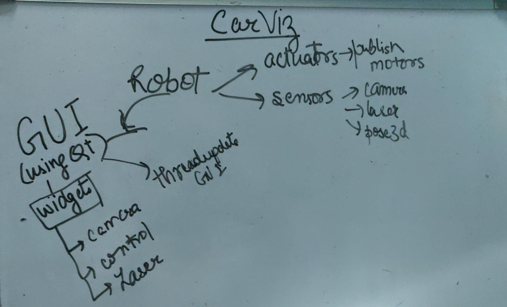
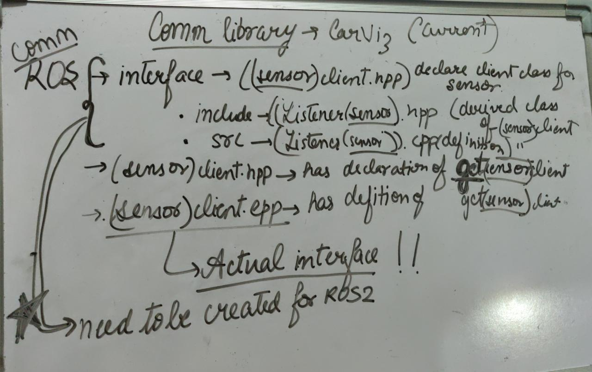

---
layout: post
title: Week-9
date: 2019-07-25
---	

**Goals of the week**

* Solve Asynspinner issue in ROS2 to complete camviz

* Refactor carviz

**Update:**

Turtlebot is not ready for dashing yet. Updates on [Update turtlebot3 to sync ROS2 Dashing](https://github.com/ROBOTIS-GIT/turtlebot3/issues/426)

So, we don't have a mobile base robotics platform right now with both ROS1 And ROS2 support.

**Carviz current code architecture** 

To work into a big complicated tool it is better to get a simple flow of components. Here, I created one from present code.

Most complicated part is the comm library which has to be changed with ros-ros2 interface. To maintain simplicity I have created the  flow of all include and source files in comm library which will be used by carviz OR ANY OTHER APPLICATION IN JDEROBOT!!

**Changing elements from Comm library**

* Do we need jdrc kind of variable in current implementation?

