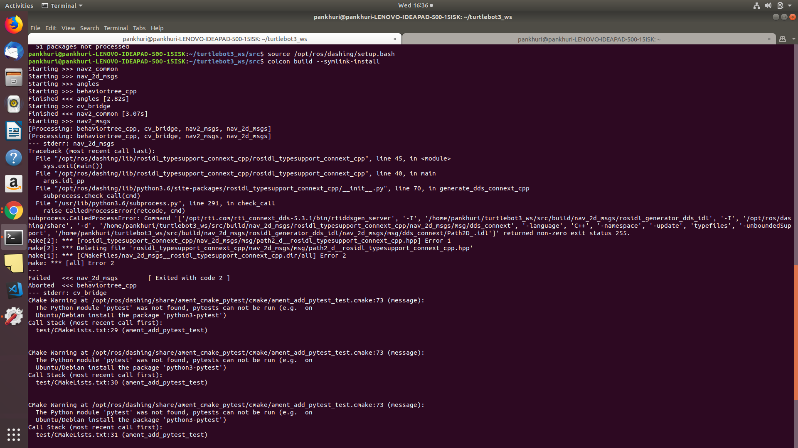
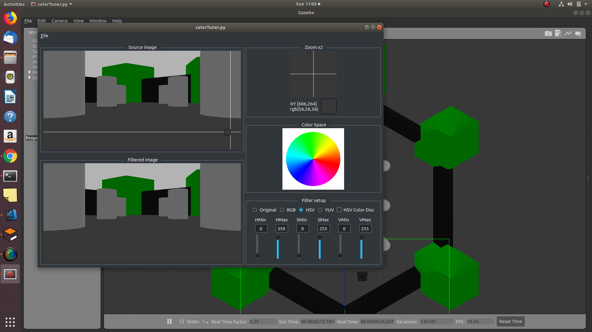

---
layout: post
title: Week-10
date: 2019-07-30
---	

**Goals of the week(decided in last week's meeting)**

* Solve Asynspinner issue in ROS2 to complete camviz

* Refactor carviz

**Progress 1**

**Carviz separated from base repository and rosified completely**

* Because of issue discussed in [absolute-path-jderobot-libraries](https://github.com/JdeRobot/viz/issues/35#issuecomment-511744843) I am leaving absolute path in all jderobot libraries that I am using.


N.B.***To use the current carviz-rosfied I have changed file "/opt/jderobot/include/jderobot/types/rgbd.h" , I have put absolute path of image.h here.


**Progress 2**

**Errors in installing Turtlebot3 packages for ROS2 Dashing**

Since I got some updates of Turtlebot3 I tried to install the packages as given in [ROBOTIS_e-manual](http://emanual.robotis.com/docs/en/platform/turtlebot3/ros2/#ros2) . But I got errors and after checking more into it I found updates have been made for OpenCR, maybe have to wait a little more.



Update: Turtlebot3 packages for ROS2 Dashing will be released on 20th August

**Progress 3**

**CarViz tested with turtlebot3-waffle**

Steps to run the tool:

Terminal 1:

```source /opt/ros/melodic/setup.bash ```

```roscore```

Terminal 2:

```source /opt/ros/melodic/setup.bash ```

```export TURTLEBOT3_MODEL=waffle```

```roslaunch turtlebot3_gazebo turtlebot3_world.launch```

Terminal 3:

```cd /folder/carViz/build/carviz$  ```

```./carViz carVizReal.yml ```

**(Click on the image to view the video)**

 [](http://www.youtube.com/watch?v=Cto_d_tk12I "carviz-turtlebot-ros-only")
 
 **Progress 4**
 
 **ROS2-Camviz**
 
 Segmentation fault: Issues open : 
 
*  [Segmentation fault](https://github.com/TheRoboticsClub/colab-gsoc2019-Pankhuri_Vanjani/issues/7)

*Conclusion after debugging: This is not a JdeRobot Image library issue with ROS2. Cameraclient class is not returning the client and giving the segmentation fault*
 
* [Alternative for asyncspinner in ROS2](https://github.com/TheRoboticsClub/colab-gsoc2019-Pankhuri_Vanjani/issues/6)

*Solved the blocking callback issue in multithreaded::executors by using run (protected member function) instead of spin(which does blocks callbacks)*

Currently I am stuck in this part, I don't have any clue how to go ahead. 

**Progress 5**

**ColorTuner tool**

1. Trying to run it using ICE drivers only as I am getting errors. [#1381](https://github.com/JdeRobot/base/issues/1381)

2. Studying the codebase

3. Studied about structuring a python packages and qt tool with python

Update 1: Colortuner errors solved. Now, working on refactoring it for ROS1

Update 2: 

*ColorTuner separated from base repository

*Colotuner rosified, some part of code cleaning left.

**ColorTuner tested with carviz tool in gazebo with Turtlebot3**




