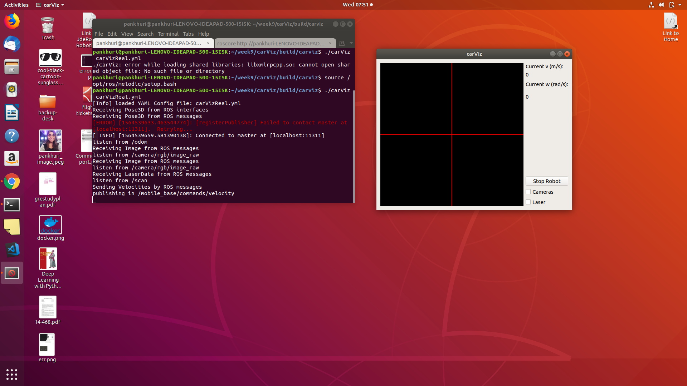

---
layout: post
title: Week-10
date: 2019-07-30
---	

**Goals of the week**

* Solve Asynspinner issue in ROS2 to complete camviz

* Refactor carviz

**Progress 1*

**Carviz separated from base repository and rosified completely**

N.B.***  To use the current carviz-rosfied I have changed file "/opt/jderobot/include/jderobot/types/rgbd.h" , I have put absolute path of image.h here.
