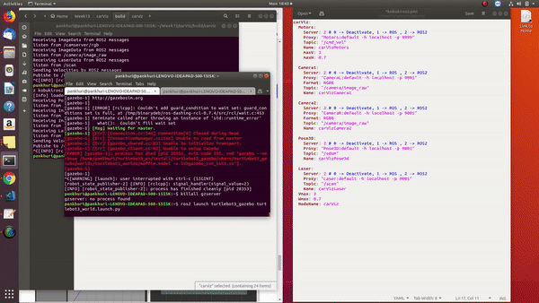

---
layout: post
title: GSoC'19 Final Report
date: 2019-08-23
---	

**Migration of JdeRobot Tools to ROS2**

ROS has changed the world of Robotics, now we need not write every single library for a new project which has already been implemented before. Researchers and developers can work on top of developed tools and libraries. ROS2 has brought good changes with it, including all features of ROS along with new ones to address shortcomings in earlier version. To make use of those characteristics it is important to migrate our tools and drivers. This project aims to adapt drivers and some crucial JDERobot tools to make them ROS2 compatible.

An interesting blog to appreciate the concept of migrating to ROS2 [Why ROS2?](http://design.ros2.org/articles/why_ros2.html)

**My contribution:**

Jderobot tools were initially developed on ICE (Internet Communication Engine). With increasing popularity of ROS due to its efficient productivity many of the tools were extended to support ROS. 

ICE has almost deprecated now, so it was the time to move ahead and have support for ROS and ROS2. Earlier interface provided compatibility of both ICE and ROS via JdeRobot Comm(Communication) library. 

My work involved removing ICE support from the tools in order to ROSify them. Most of these tools were dependent on official base repository, I contributed in making them standalone tool.
I created new comm library with architecture similar to previous one. In this new library support for ROS2 drivers was incorporated. 

Major tools which were in scope of this project during GSoC'19 period are:

**1. Basic Image Tool**  Note: (Click on image to watch video:)

A simple dummy tool was developed which showed the use of ROS1+ROS2 interface efficiently. Images were subscribed to publsiher and displayed with  OpenCV GUI.

**2. CamViz**

This is a cpp tool, concerned with the client side. 

CamViz takes image from Pubisher, sends it to GUI (it has it's own Gtk based GUI, unlike Image Tool) and displays the continous stream of images. It can be used to take images from USB-cam as well as camera attached on a Robot.

(Put video here)

**3. ColorTuner**

Colortuner component implements three different image color filters in the next color spaces: RGB, HSV, YUV. It is an application to configure tailored color filters in HSV, RGB, or YUV color spaces. It is used to obtain optimal values of tint and saturation, as well as lighting, in that kind of filters. To perform the different color conversions between spaces we used the conventions appear in wikipedia, (HSV color conversions), and for YUV, (YUV color conversions) .

This tool only has one thread who cares about getting images and showing them throug the GUI. 

ColorTuner connects the new ROS1+ROS2 interface to a camera server (real or simulated) and takes images from it and each image is shown through an GUI class (called viewer').

It is a python based tool which uses Qt for GUI

 
 
 **4. CarViz**
 
 CarViz is a teleoperation tool which can be used for Mobile robots.
 
 It gives the functionality of teleoperation as well as viewing the raw data of sensors like laser and camera placed on Robot. 
 
 This tool has been tested with Turtlebot3 in ROS and Turtlebot3 and Dolly robot in ROS2.
 
  
  
  [

 
 **5. VisualStates Tool**
 
VisualStates is a tool for the programming of robot behaviors using hierarchy finite state machines (HFSM - Hierarchichal Finite State Machine). It represents the robot's behavior graphically on a canvas composed of states and transitions. When the automata is in a certain state it will pass from one state to another depending on the conditions established in the transitions. This graphical representation allows a higher level of abstraction for the user, as she only has to worry about programming the current robot actions and select what components he may need of the robot's interface.

It has two different user interfaces: the visualStates GUI, python runtime GUI. The visualStates GUI enables the design of automatas and python runtime GUI provides a visualization of the running automata.

Current Status: 

* Codebase migrated to ROS2.

* Visualstates GUI working fine.

* ROS2 python node is being generated properly.

* Issue in application: Bugs in original examples of this tool. They need to be fixed, before testing those examples with ROS2. 

**A summary of major work done with their links and PR's:**

| *Sub-project* |  *Status*     |  *Timeline* | *Links*  | *Additional Comments* |*Merged PR'S* |
| ------------- | ------------- | ----------- | ---------| --------------------- | -------------|     
| Debug Camviz      | Done | Week-1      |   [Link](https://github.com/JdeRobot/viz/pull/32)       |  PR merged for bug fixing        |   [PR#32](https://github.com/JdeRobot/viz/pull/32)       |                     |
| yaml support for ROS2 image drivers      | Done     |  Week-1       | [ros2-drivers](https://github.com/TheRoboticsClub/colab-gsoc2019-Pankhuri_Vanjani/tree/master/ros2-drivers)         | Fixed the error which was coming pre-gsoc period. These drivers were used in image tool later    |  - |            
| Migration to Dashing | Done      | Week-1          |    -      |   Installation and learning task                   | -|
| ROS1-ROS2 Interface | Done      |  Week-2         |  [cmakefile](https://github.com/TheRoboticsClub/colab-gsoc2019-Pankhuri_Vanjani/blob/master/dummyexample/CMakeLists.txt)        |    Getting right CMakelists.txt was the challenges of this task                 |  |
| Dummy library- 'Hello World!' | Done      |  Week-2         |    [dummy-library](https://github.com/TheRoboticsClub/colab-gsoc2019-Pankhuri_Vanjani/tree/master/dummyexample)      | Important to work on simplified problem before moving to complex so hello world! library helped in creating a basic tool whose complexity was increased later            | -|
| Image tool | Done      |   week-3  + week4      | [Youtube](https://www.youtube.com/watch?v=E6v-G0QFUSg&feature=youtu.be) , [scripts](https://github.com/TheRoboticsClub/colab-gsoc2019-Pankhuri_Vanjani/tree/master/image-tool-scripts) [codes](https://github.com/TheRoboticsClub/colab-gsoc2019-Pankhuri_Vanjani/tree/master/camera-interface) |  Finished succesfully   | N/A|                 |
| Docker | Done      |  week-3 + weeek4         | [docker](https://github.com/TheRoboticsClub/colab-gsoc2019-Pankhuri_Vanjani/tree/master/Dockerfiles)         |  Course done on docker. Since a workaround was found no need of docker right now. Facing error in starting video drivers from docker    |  -|
| Teleoperation tool | drivers completed in C++ and Python with interface   |  week5   + 6    |   [Teleoperation-drivers](https://github.com/TheRoboticsClub/colab-gsoc2019-Pankhuri_Vanjani/tree/master/Teleoperation_tool)     |  Searching for robot support was one big challenge in this week | |
| Study CamViz tool | Done      |  week7       | N/A  | studied codebase of this tool and comm library which has ICE+ ROS drivers | -|
| CamViz-Rosify   | Done      |  Week8       | N/A  | Isolated CamViz tool from official repository and rosified tool | -|
| CamViz-ROS1+ROS2 support   | done      |  Week9 - Week12      | [camVIz](https://github.com/pankhurivanjani/viz/tree/viz-ros2/camViz) | Challenge of using threading as a workaround as an alternative of ros::Asyncspinner in ROS1 | [PR#39](https://github.com/JdeRobot/viz/pull/39)|
| Refactor Carviz    | Done      |  week10      | - | Isolation and rosification of CarViz tool was done| |
| Carviz-ROS1+ROS2 support   | Done      |  week10 -Week12     | [CarViz](https://github.com/pankhurivanjani/viz/tree/viz-ros2/carViz) | Solving threading issue in camViz solved issues in thi repo too|[PR#39](https://github.com/JdeRobot/viz/pull/39)|
| ColorTuner tool   | Done      |  week10 -Week11   | [ColorTuner](https://github.com/pankhurivanjani/ColorTuner) | First Python tool completed | [PR#6](https://github.com/JdeRobot/ColorTuner/pull/6)|
| VisualStates Tool   | in-progress   |  week12  | (put link  | Error in generated ros2 node  | (in -progress)|

Playground Repository: [TheRoboticsClub/colab-gsoc2019-Pankhuri_Vanjani](https://github.com/TheRoboticsClub/colab-gsoc2019-Pankhuri_Vanjani)

**Future Work**

* Refine codebase of camViz, CarViz, colortuner to keep a single Comm library for whole viz repository 

* Laser GUI in CarViz is not showing data from sensor. Solve this issue.

* Work with visualstates developers to solve bug in examples. Bring those fixes to ROS2 version of visualstates.

*If time permits in future*
 
* Migrate Drone viewer tool when we get support for a drone in ROS2.

* Add more complex examples with visualstates and 

**New skills developed during GSoC period**

This was a great learning period, I got the opportunity to grasp new skills and polish old ones. Some of them are worth mentioning: 

* Learnt Docker

* Learnt Working with GUI tools especially GTK and Qt

* Improved OOPS(Object oriented programming)

* Learnt basics of threading

* ROS1 and ROS2 concepts in depth 

* Improved CMake skills 

* Learnt how to study and work with large codebase

*Other than these tech-skills there were other lessons learnt from mistakes:*
 
* Patience 
 
* Don't ignore the approaches if not getting results. It might be just a syntax error. Dig out the correct one.

* Don't stick to the provided code architecture. If a problem is not getting solved feel free to create a new one.

**Major Challenges & GSoC journey**

* Frequently Switching between Versions while migrating tools from ROS1 -> ROS2

    * Ubuntu 16.04 -> Ubunutu 18.04
     
    * Python 2 -> Python3
    
* Lack of support of a Mobile Robot and several drivers during many weeks of GSoC period 

* Due to Electronics and Communication background I was unfamiliar with few fundamental CS concepts. Studying them side by side while implementing was a challenge but due to it I was able to push my boundaries.
    
**Acknowledgements**

I would like to thank JdeRobot for providing me this wonderful opportunity to work this emerging technology, especially My mentors JoseMaría Cañas and Vinay Sharma for always supporting and guiding me. Also to Francisco Pérez and Pushkal Katara who helped in getting through JdeRobot tools.

I received diversity scholarship for attending ROSCon this year, My project had a major role in its application. If possible I would like to take it there in lightening talk. 

